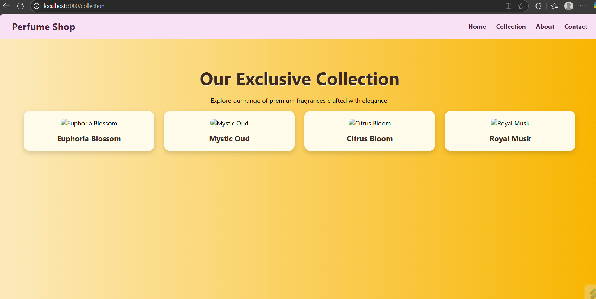
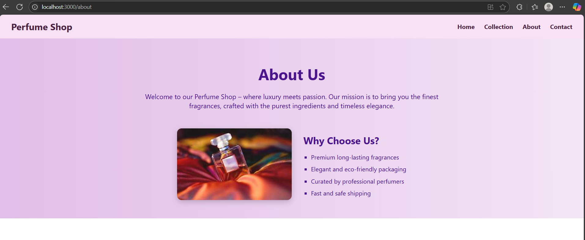

##Features Implemented
#Frontend (React):
Responsive Navbar

Attractive Call-to-Action Banner

4 Product Cards with image, name, description, and price

Hover Effects on product cards

Redirection to a detailed product page on click

Product Detail Page includes:

Full Description

Multiple Sizes

Reviews Section (static with MongoDB data)

Image Gallery

Share Button

#Backend (Express + MongoDB):
REST API using Express.js

Data stored in MongoDB Atlas (No static values)

/products API to fetch all perfumes

/product/:id to fetch a single perfume with details and reviews

CORS enabled and JSON parsing middleware added

Screenshots
Homepage

Product Cards

Product Detail Pages

About page

Contact us

MongoDB Products Collection

Folder Structure
Perfume-Shop/
├── client/ # React Frontend
│ ├── src/
│ │ ├── assets/ # All product images (JPG/PNG)
│ │ ├── components/
│ │ │ ├── Navbar.js
│ │ │ ├── Banner.js
│ │ │ ├── Products.js
│ │ │ ├── ProductDetail.js
│ │ └── App.js
│ └── package.json
├── server/ # Express Backend
│ ├── server.js
│ └── .env
├── README.md
├── screenshots/ # Folder containing all screenshots for assignment
└── package.json

## Installation and Running Instructions

Frontend (React)
cd client
npm install
npm start

Backend (Express + MongoDB)
cd server
npm install
node index.js

API Endpoints
Method Route Description
GET /products Get all products
GET /product/:id Get single product by ID

##Sample MongoDB Document (in products collection)
{
"id": "2",
"name": "Mystic Oud",
"description": "A bold and spicy fragrance for special occasions.",
"price": "₹2,499",
"sizes": ["50ml", "100ml"],
"images": [
"https://via.placeholder.com/300x300?text=Mystic+1",
"https://via.placeholder.com/300x300?text=Mystic+2"
],
"reviews": [
{ "user": "Charlie", "text": "Smells luxurious and deep." }
]
}

### Technologies Used

Frontend: React, React Router, CSS

Backend: Express.js, Node.js

Database: MongoDB Atlas

Tools: VS Code, Postman, Git, npm

Deployment link
https://perfume-shop-luxury-products.netlify.app/
